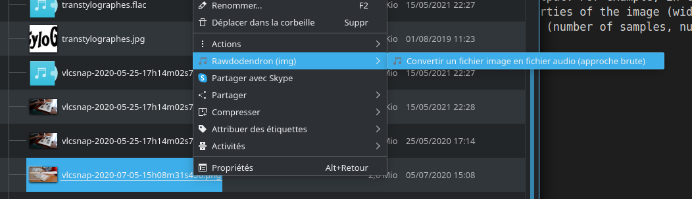
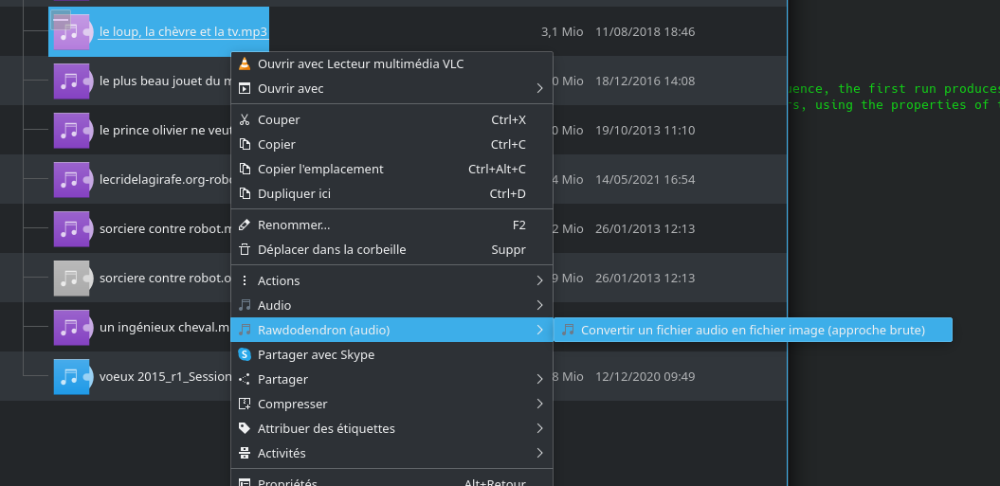
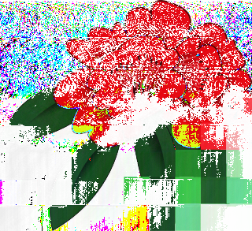
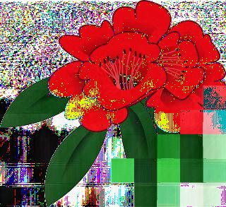

# rawdodendron


An audio/image converter using a raw approach. A byte-to-byte conversion is provided between image file and audio files (in both directions), in order to misuse image and sound processing algorithms.

Using this tool before and after using a [Digital Audio Workstation](https://en.wikipedia.org/wiki/Digital_audio_workstation) (such as audacity, ardour or reaper) gives a way and to apply audio filters on images.

Using this tool before and after using a [Raster Graphic Editor](https://en.wikipedia.org/wiki/Raster_graphics_editor) (such as gimp) gives a way and to apply image filters on audio files.


*This tool is inspired by Cécile Georges' artistic practices, and aims to extend the possibilities offered by digital bending.*


## Dependancies

* [pydub](http://pydub.com/)
* [pillow](https://pillow.readthedocs.io/en/stable/)
* [argparse](https://docs.python.org/3/library/argparse.html)
* [appdirs](https://pypi.org/project/appdirs/)

### Install dependancies on a debian system

```
sudo apt install python3-pydub python3-pil python3-appdirs
```

## Installation

- Add dependancies (see below)
- Download this repository
- run ```./install.sh```

## Usage

### Command line

Without spectific option, the script is using history to adjust the properties of the output. For example, in the following sequence, the first run produces a stereo 44.1 kHz audio file (default format), and store in the history the specific properties of the image (width, height, RGB/RGBA). The second run uses the history to identify the correct image parameters, using the properties of the audio file (number of samples, number of channels and sample rate)  as a filtering to identify the possible configuration of the audio file ancestor.

* ```rawdodendron.py -i image.png -o audio.wav``` to convert an image to an audio file
* ```rawdodendron.py -i audio.wav -o image.png``` to convert an audio file to an image

You can of course force properties using command line parameters:

* ```rawdodendron.py -i audio.wav -o image.png -w 300 --rgb```

All the command line parameters are visibles using the following command:

* ```rawdodendron.py -h```

### Service menu on KDE

Right clic on an image file and find the *rawdodendron* entry to convert it to an audio file.



Right clic on an audio file and find the *rawdodendron* entry to convert it to an image file.



## Examples

Some images generated from an RGBA png version of the initial *rhododendron* image, using the following process:

* convert the image to an audio file
* apply an audio processing algorithm (compression, reverb)
* convert back to an image




The last image is the result of a reverb, but from an RGB image (without alpha channel):


